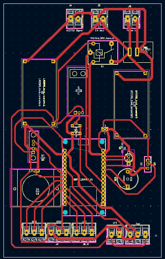
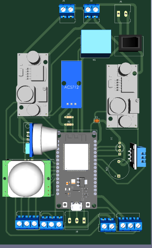
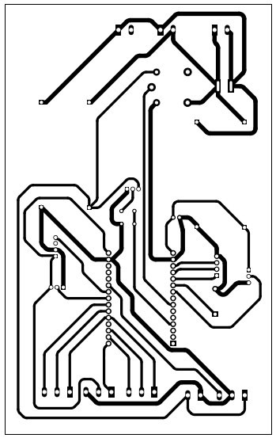

# Hardware

This repo holds our PCB schematics and PCB design and is used for version control of PCBs.

## PCB design directory

The directory holds the **Project_Libraries** and schematics and PCB design.

Thr Project Libraries folder contains custom symbols and footprints of the sensors used. The component used can be found within the Home.csv file. that is the BOM.

## Bill of Materials

The components needed to replicate this PCB and project are:

- 1 ESP32 DEVKIT V1 microcontroller
- 2 LM2596 Buck converters
- 1 Buzzer
- 1 RGB LED (or three  LEDs, note to add resistors if used)
- 7 2-pin screw terminal blocks
- 2 3-pin screw terminal blocks
- 1 ACS712_5B sensor (current sensor)
- 1 DHT11 sensor (Temperature and Humidity)
- 1 PIR sensor (motion sensor)
- 1 MQ2 sensor (gas sensor)
- 1 Relay

There are components attatched to the PCB externally:

- 1 Fan
- 1 LCD with I2C
- 1 EM Lock
- 1  RFID card reader (RFC522)
- 12V power supply
- 1 Relay module

## The PCB Schematic

### Power Distribution

Components used had different power needs. The use of two buck converters is to ensure that the components that were powered by 3.3V, 5V and 12V are catered for.
An external power source of 12V is used to power the PCB through the power terminal that is the power input of the PCB. Power is the distributed from there.

### External connections

Terminals are used as input and output to components used externally such as the RFID card reader, Electromagnetic lock, fan and LCD. The ACS terminal is used as input of the voltage to be measured by the ACS712 sensor.

## PCB

### Layers of the PCB

Courtyard - Boundary of a footprint.
Fab - Stands for . It gives more information on fabrication to the manufacturer.
Adhesive - Layer to glue components that need to be put in place.
Paste - Layer to apply solder mask onto a PCB.
Silkscreen - Layer to label components and print onto.
Mask - Protects the PCB circuit adn insulates the copper from oxidation.
Copper layer - where copper routes are made and grounding places are set.

As we were fabricating ourselves, some of the layers were not needed, such as mask, fab. adhesive.

### Constraints set up

1. Minimum clearance - this is the minimum distance between 2 tracks. Too small of clearance and tracks might end up being short circuited. 0.15 is the standard requirement for the PCB.
2. Track width - this refers to the thickness of tracks. Small tracks may cause open circuits in the PCB and therefore is discouraged. The amount of current drawn by the components is a factor that should be considered. however, overall, 0.15 is good practice. The power tracks and signal tracks have different sizes due to the amount of current drawn. The 12V power tracks are thicker as they carry more current compared to ther other tracks.
3. Minimum connection width - this refers to the minimum connection between 2 components of the width is less than threshold, connection may be broken.
Kicad provides a track width calculator, we set the 12V tracks to carry 1A of current and the other tracks carrying less that 1A.

4. Minimum through hole - This is the minimum diameter of a trhough hole pin. 0.8 is set because the least strongest drill bit we can use without breaking is 0.8mm.

5. Copper to edge clearance - this is the least distance that can be there between a copper track and the edge cut. A small distance may lead to the copper tracks being cut out during fabrication of the PCB, hence a suitable legnth should be set between them.

### PCB Routing

The PCB routing was done manually to ensure there were no errors. The shortest paths were used where possible, however, due to arrangement of components and connections, other alternative longer paths were taken to enable connection of all paths. The routing is only on the front side of the copper clad so as to easen DIY manufacture. aligning components on both sides would make aligning of tracks holes hard, hence one side is more efficient.
The arrangement was factored by power requirements, whether the components are analog or digital and specific positioning of some components. Components that needed 5V power were grouped together and components that needed 3.3V power were grouped together. Analog components and digital components were grouped together, respectively to prevent crossing of lines during routing. The terminal blocks were set to the edge of the PCB to ease connection to external components. The ESP32 microcontroller was set in the middle of the board to easen access of all sensors and terminal blocks to it and resuce the legnth of tracks.
The tracks are filleted to reduce inductance and therefore reducing cases of reflection caused by sharp corners in the tracks by sharp edges.
The tracks used are 1.7mm thick for power tracks and 1mm thick for signal tracks. The power tracks are thicker as they carry more current and the thick tracks are to ensure that the tracks don't break when etching. They also have less heat dissipation. The other tracks are narrower to ease routing and control impedence.

### 3D PCB

After routing, the final PCB would be expected to look like this:

This is the desired output after fabrication.

To prepare for fabrication, we plot the PCB layers and ensure that the edge cut is in each plot.

Plotting:

The front copper layer is the one we need:

## Fabrication

### Components needed for fabrication

- HCL
- Hydrogen Peroxide
- Acetone
- Glossy paper
- Laser Printer
- 0.8mm drill bit
- 1.0mm drill bit
- PCB drill
- Rough sand paper or a substitute(we used steel wool)
- Smooth sand paper or substitute( we used supabrite)

### Procedure

#### Etching Process

1. Print the PCB plotted design on a glossy paper using a laser printer.
2. Cut the required dimensions of the PCB onto the copper clad and file the edges to ensure a smooth
and even edge.
3. Sand down the copper clad with fine sand paper until its shiny. Ensure all grease and fingerprints is
off of it as this may make it difficult for the toner to transfer.
4. Place the glossy paper on the copper clad, toner sider down and iron it with clothe iron for 50
minutes. Make sure heat is evenly distributed, especially with the edges and corners
5. Wait for it to cool before removing the glossy paper.
6. Once cooled, remove the glossy paper and be gentle with places where the paper is still stuck. The
toner is transferred and is now ready for etching.
7. In the case of a two-sided PCB, follow the stpes from 3-6 on the other side of the PCB. Ensure it is
well aligned with the holes at the top.
8. Use a solution of hydrogen peroxide and HCL to etch in the ratio of 2:1. For safety pour the
hydrogen peroxide into HCL, and ensure to wear a mask during the etching process as dangerous
fumes are emitted.
9. Gently place the PCB into the solution using a pliers, close the lid of the container and shake it
gently to ensure all exposed copper is eroded.
10. Open the container and occasionally turn the PCB until all the exposed copper is eroded.
11. Once etching is complete rinse the copper clad with water nd pour acetone on the PCB while
scrubbing out the toner. The parts covered with the toner expose the wanted copper.
12. Using a multimeter check for continuity of the tracks.
13. Fix discontinued tracks with soldering wire

#### Assembly of the PCB

14. Solder the components onto their respective footprints
15. Test PCB with the firmware.

## Challenges

1. On our first attempt, we made our copper tracks to thin. Below is the plot:

After etching this was the result:

As seen above, some of the tracks are broken as they are too thin that they're disconnected.
2. Breaking of drill bits while drilling. The 0.8mm drill bit proved to be too delicate and thus we changed all footprints to have a hole diameter of 1.0mm so as to use the 1.0mm.

## Recommendations

 1. Read documentation of the microcontroller in use and components to ensure you meet their requirements.
 2. Use a stronger and more durable drill bit.
